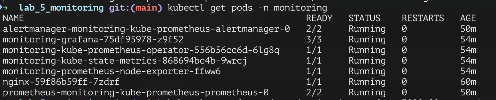
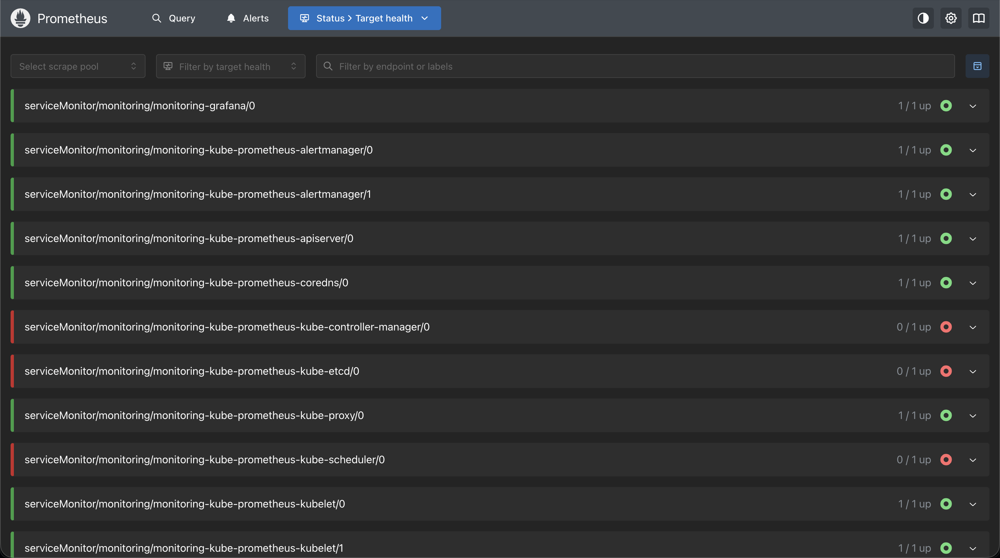
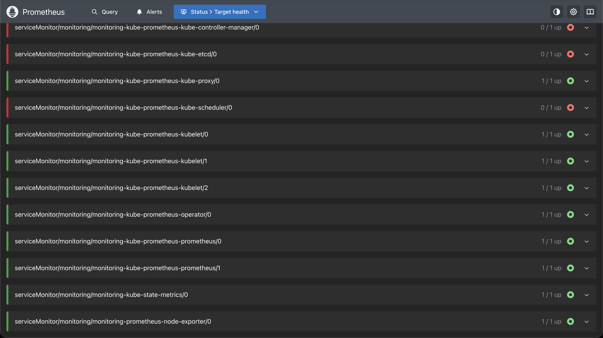
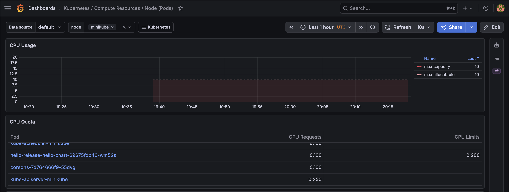
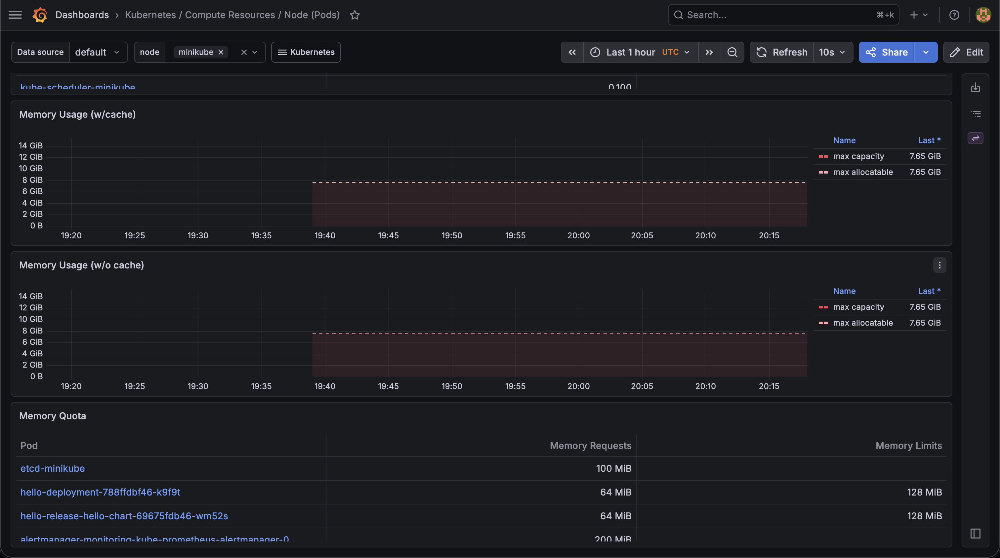

# Лабораторная №5. Мониторинг в Kubernetes

Подняла nginx в minikube, настроила сбор метрик через Prometheus и визуализацию в Grafana.

## Стек

- minikube
- Prometheus + Grafana (через helm-чарт `kube-prometheus-stack`)
- nginx как monitored-сервис

## Как запускала

```bash
minikube start

kubectl create namespace monitoring
kubectl apply -f k8s/app-deployment.yaml

helm repo add prometheus-community https://prometheus-community.github.io/helm-charts
helm repo update
helm install monitoring prometheus-community/kube-prometheus-stack -n monitoring
```

## Результат

### Поды



Все компоненты поднялись в namespace `monitoring`.

### Prometheus — Targets

Prometheus подтягивает метрики с компонентов кластера. controller-manager, etcd, scheduler недоступны тк они не экспортируют метрики по умолчанию.





### Grafana — графики

Дашборд: **Kubernetes / Compute Resources / Node (Pods)**

**CPU Usage:**



**Memory Usage:**


